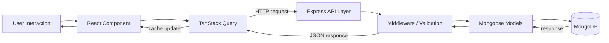

# Architecture Overview

This document gives a high-level mental model of how goodWill is structured. It's a living document — it tracks the macro shape of the system, not specific routes or file paths, since the backend is under active refactoring.

## Tech Stack

| Layer | Technology | Role |
|---|---|---|
| Frontend | React + Vite | UI rendering, fast dev/build tooling |
| Frontend | TypeScript | Type safety across components |
| Frontend | Tailwind CSS | Styling |
| Frontend | TanStack Query | Server-state caching, fetching, and sync between UI and API |
| Backend | Express.js | HTTP API layer, request handling, middleware |
| Backend | MongoDB + Mongoose | Persistent storage and schema modeling |

## System Flow

A typical user action (e.g. donating blood, viewing hospital stock) flows like this:

In words:

1. A user interacts with a React component (e.g. clicking "Donate").
2. TanStack Query triggers a request and manages loading/cache state.
3. The request hits the Express API layer, passing through middleware (auth, validation, etc.).
4. Express delegates to Mongoose models to read/write MongoDB.
5. The response travels back up the same path; TanStack Query updates its cache, and React re-renders with fresh data.

## Core Folders

### `src/` — Frontend
Houses the React application: UI components, pages/views, hooks (including data-fetching hooks built on TanStack Query), and shared frontend utilities. This is where presentation logic and client-side state live.

### `init/` — Backend
Houses the Express server: route handlers, controllers (business logic), Mongoose models/schemas, and seed scripts for populating test data. This is where persistence, validation, and server-side logic live.

The boundary to keep in mind: **`src/` decides what the user sees and how they interact; `init/` decides what's true and persisted.** Specific routes, controller names, and schema fields may change as the backend is refactored — this division of responsibility should not.

## Notes

- This document intentionally avoids hardcoding specific endpoint paths or schema fields, since both are subject to change during ongoing refactors.
- As major architectural decisions are made (e.g. introducing a new layer, swapping a tool), this file should be updated to reflect the current macro structure.
